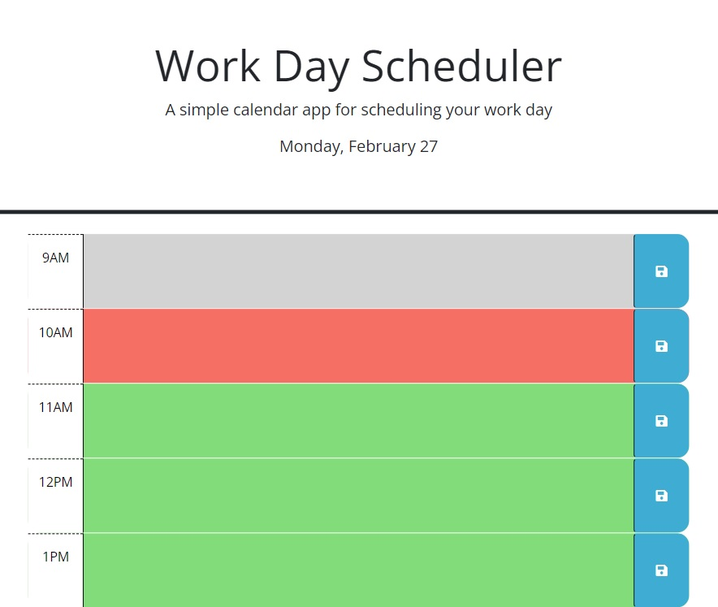
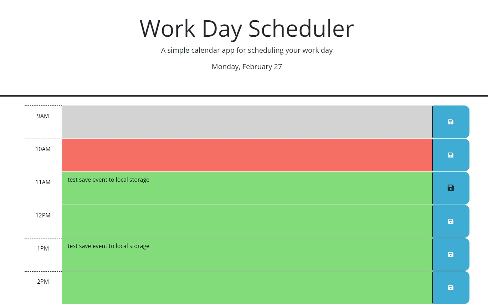

# Work Day Scheduler

## Description

Created a Work Day scheduler that allows users to save events for each hour of the day following standard work hours. I used Day.js in order to work with current dates and times.

Published website:  https://molyneauxk93.github.io/KevinMolyneaux-Work-Day-Scheduler/

## Installation

N/A

## Usage

Use Kevin Molyneaux's Work Day scheduler to plan out your work day and improve your productivity.

## Credits

N/A

## License

MIT License - Please refer to the LICENSE in the repo.

## Usage
The following image shows the Work Day scheduler page. Day.js library was used to include the date in the header of the page, it was also used in conjunction with the IDs in the HTML to color code the hour time slots on the page. Red shows the current time block, gray are past time blocks, and green are future time blocks:

The follwing image shows the functionality of adding event details to a times block, once desired input is entered, select the save icon to save events to local storage:

